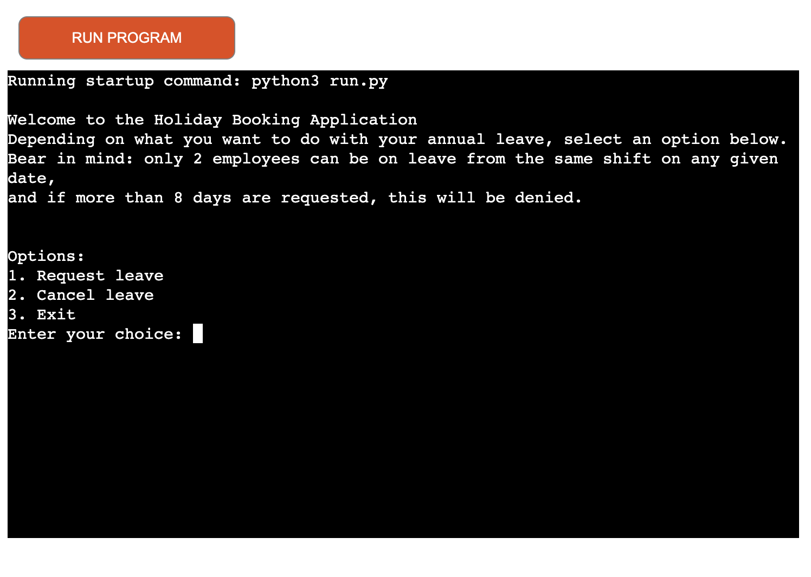
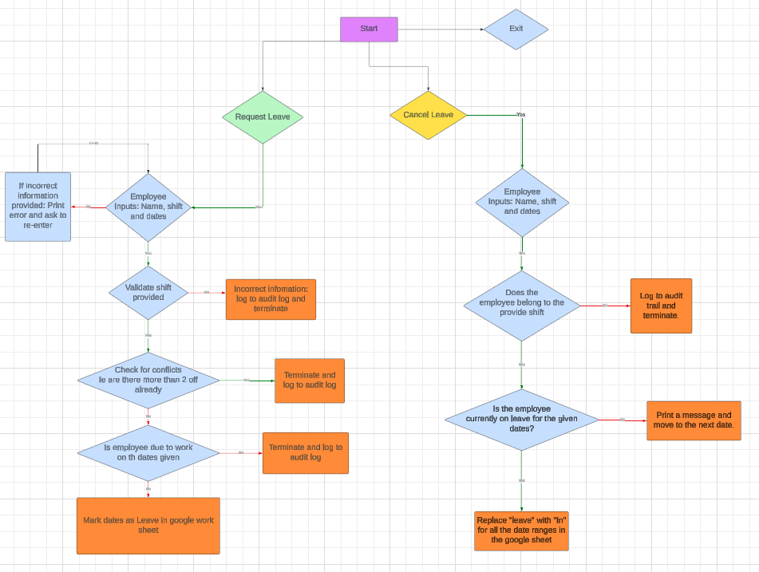
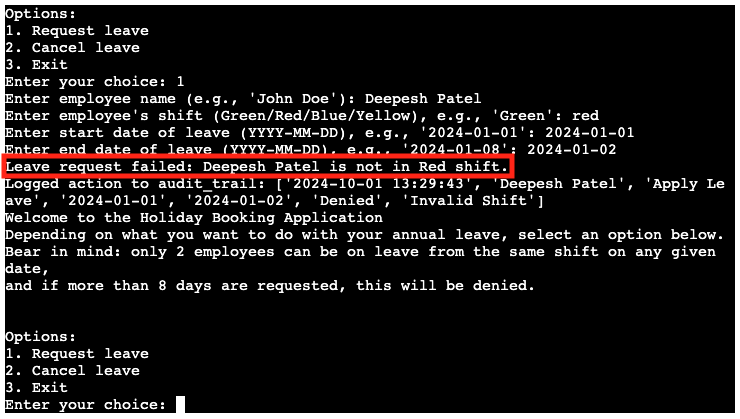
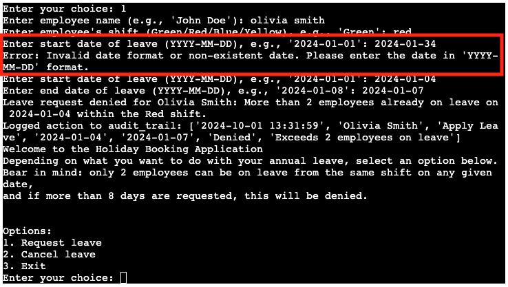
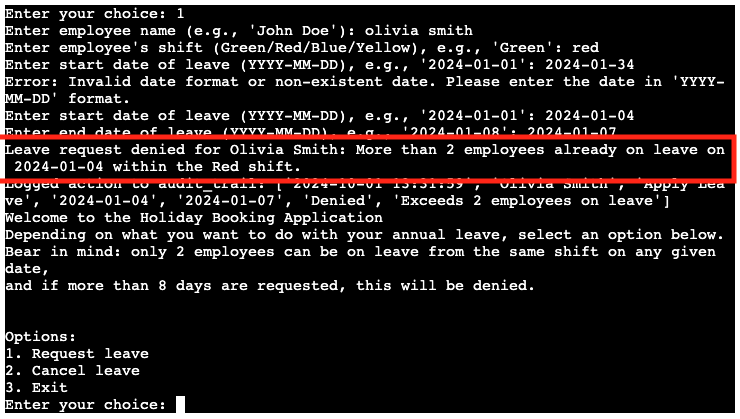
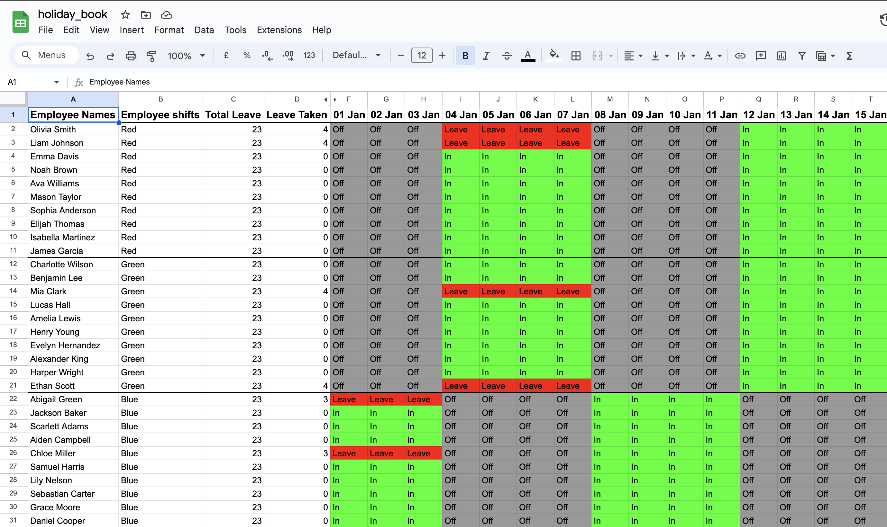
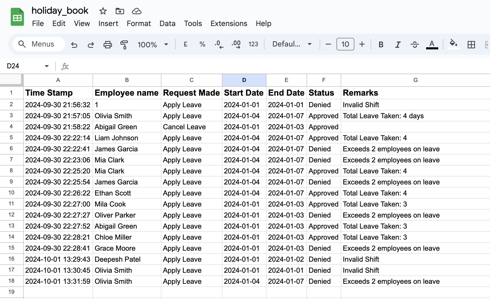
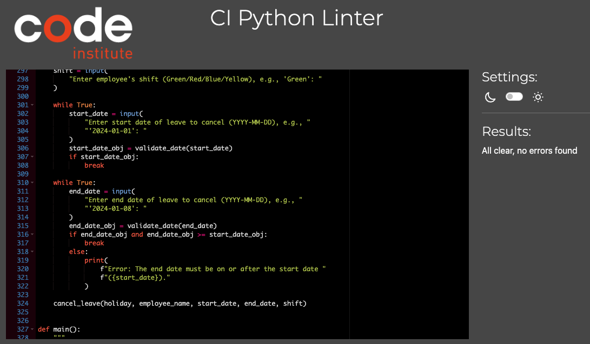

# Holiday Book Management

The Grand Crisps PLC employes over 40 employees working across 4 shfits. The HR department was overwhelmed with daily queries regarding holiday availability, shift schedules, and leave approvals. Additionally, it was common for employees to submit leave requests at the last minute, leading to a lack of visibility and planning conflicts, especially when too many employees from the same shift applied for leave simultaneously.

To address these challenges, a consultation took place with HR representatives and employees to explore ways to streamline the holiday booking process and ensure that the company maintained adequate shift coverage at all times. As a result, the HR team requested the development of a digital holiday booking application that would provide a centralized system for employees to request leave, track availability, and receive real-time approvals.

The goal of this new system was to minimize the administrative burden on HR, reduce confusion among staff, and implement a fair leave allocation policy that considers shift requirements. This app has ultimately provided the company with better oversight, improved employee satisfaction, and a more organized approach to managing leave requests.

The live deployed project link is [HERE](https://holiday-booking-084cf2358c93.herokuapp.com/)

## Contents
* [Introduction](#introduction)
* [Project](#project)
  * [User goals:](#user-goals)
  * [Site owner goals](#site-owner-goals)
  * [Pre-Development](#pre-develepment)
* [Features](#features)
* [Google Sheets](#google-sheets)
    * [Holiday-sheet](#holiday-sheet)
    * [Audit-Log](#audit-log)
* [Technologies Used](#technologies-used)
* [Resources](#resources)
  * [Libraries](#libraries)
* [Testing](#testing)
* [Future Updates](#future-updates)  
* [Validation](#validation)
* [Deployment](#deployment)
* [Bugs](#bugs)
* [Credits](#credits)
* [Acknowledgements](#acknowledgements)

## Introduction
The holiday booking application allows employees to input their name, shift type, and the start and end dates of their requested leave. Once submitted, the system checks the availability based on existing bookings and the company’s policy of limiting the number of employees from the same shift on leave at the same time. If the request meets the criteria, it is automatically approved and logged in the system. The data is then forwarded to HR for record-keeping, via the audit log.

## Project

### The aim of this project is to:

* Reduce the number of manual holiday requests and queries made to HR.
* Encourage employees to plan and submit their holiday requests in advance.
* Provide a centralized system that automatically updates HR and notifies the employee with confirmation of their request.
* Offer clear, user-friendly instructions and a streamlined interface to guide employees through the booking process efficiently.

### User Goals:
* Easily access clear instructions on how to use the system for booking holidays.
* Enter their details, including name, shift type, and the desired start and end dates for leave.
* Be aware of the remaining leave post applying or cancelling leave.
* Ensure that their leave request complies with company policy (e.g., no more than two employees on leave from the same shift).

### Site Owner Goals
* Develop an application that is intuitive, user-friendly, and easy to maintain.
* Ensure the program presents clear instructions for employees each time they access the system.
* Implement a system that approves or denies leave request in real time.
* Record all leave requests in an audit log and maintain an employee leave schedule to track which employees are scheduled to work.

### Pre Develepment

I visualized the logical flow and decision-making process of the holiday management application using Lucidchart. This involved creating a detailed diagram that outlines the various steps and conditions the system will handle, including user input validation, leave application rules, and conflict resolution. By leveraging Lucidchart’s features, I was able to map out each function’s interactions, decision points, and workflows, providing a clear blueprint for how the system should operate. This diagram serves as a visual guide for understanding the application’s behavior and ensuring consistency in implementation.

### Development

The development of the holiday booking application followed a structured approach, beginning with the creation of the core functionalities. Initial work focused on building a basic interface to capture employee details and requested leave dates. After each core section was implemented and verified, testing identified opportunities for refinement and additional features to improve the user experience.

#### Initial Implementation
The first section developed was the **employee details input**. This section was designed to capture essential information such as the employee’s name and shift type. During testing, it was discovered that users could leave the name field blank or include non-alphabetical characters, causing data inconsistencies. To address this, validation rules were implemented to ensure that both first and last names were mandatory and only contained alphabetical characters. Instructions were also added to guide users on the correct format for entering their names.

#### Leave Request Validation

The next stage involved creating the **leave request** input, where users could specify the start and end dates for their leave. The program was designed to ensure that leave requests adhered to company policies, such as a maximum of 8 consecutive days and no more than two employees from the same shift on leave simultaneously. Initial testing showed that some users attempted to book leave spanning across shifts or requested overlapping dates, which caused conflicts in the scheduling. As a result, additional logic was added to verify that requested leave dates did not overlap with other bookings and that the employee was scheduled to work during the requested period.

#### Managing Employee Shifts

Another key component was the implementation of **shift management** to track employee work schedules accurately. Employees are categorized into four shift groups—Green, Red, Blue, and Yellow—each with its own shift cycle. Early testing revealed that the app needed a mechanism to calculate shift cycles dynamically based on a defined base date. Consequently, a dynamic date checker was developed to align holiday requests with shift cycles, ensuring that the application could determine when an employee was due to work.

#### Audit Log Integration

An **audit trail** feature was developed to log every leave request action, including approvals, denials, and cancellations. This feature was added after HR expressed the need for better tracking of historical data. The audit log captures details such as the employee’s name, the action taken, and the exact timestamp.

#### Google Sheets Integration

The application was designed to store submitted leave requests (Audit_trail) and employee schedules (Holiday) in two separate Google Sheets. One sheet records general leave information (such as requested dates and employee names), while the other tracks compliance metrics, such as the number of employees on leave per shift. During the integration, it was discovered that Google Sheets has limitations on batch updates, leading to potential delays in larger data operations. To optimize performance, a caching system was implemented, reducing the number of API calls and improving overall efficiency.

The Gogole Sheet link is [HERE](https://docs.google.com/spreadsheets/d/14PcOSpGZ5gNE0BZ7T9rBCQ-M2oeJuhhad_MDY7-8-6o/edit?pli=1&gid=0#gid=0)

### Features

#### Clear Instructions for Users

The application provides clear instructions at each stage of the booking process. Upon starting, the program outlines the steps for requesting or canceling leave, highlights the restrictions (e.g., no more than two employees from the same shift can be on leave at once), and ensures that employees understand the requirements before proceeding. This user-friendly approach reduces errors and confusion, making the system accessible to all employees.

#### Employee Name and Shift Selection

The first step in the booking process is for the employee to enter their name and select their shift. This information is validated against the records stored in the Google Sheet to ensure that only registered employees are allowed to submit leave requests. If an invalid shift is entered or the employee's name is not found, the system displays an error message, and the user can re-enter information.

#### Leave Request Input

Employees can enter their desired leave dates, including the start and end dates. The system automatically checks that the dates are within the valid range for the year (2024) and that the end date is not earlier than the start date. If the input does not meet these criteria, a descriptive error message is displayed to guide the user in correcting the format. This prevents common mistakes and ensures accurate date entries.

#### Leave Policy Compliance Checks

One of the core features of the application is its ability to enforce company leave policies. Before approving a request, the system checks if more than two employees from the same shift are already scheduled to be on leave during the requested period. If a conflict is detected, the system denies the request and logs the reason in the audit trail. This ensures that there is always adequate coverage for each shift and that leave is distributed fairly among employees.

#### Audit Log for Transparency

Every action taken within the application—whether a leave request, denial, or cancellation—is recorded in an audit trail stored in the audit_trail worksheet. Each log entry includes a timestamp, employee name, action, dates involved, and the status (approved, denied, etc.). This comprehensive record provides HR with full visibility into all leave-related activities, ensuring transparency and accountability.

#### Leave Cancellation
Employees can also cancel previously approved leave requests. This feature allows users to input the leave period they wish to cancel and validates their shift and dates before proceeding. Once confirmed, the leave is marked as "In" in the Google Sheet, and the audit trail is updated accordingly. This gives employees the flexibility to manage their schedules while maintaining up-to-date records for HR.

### Development Considerations

#### Input Validation and Error Handling

Throughout the application, various input validation techniques are used to prevent incorrect data entries. For example, date formats are checked to ensure they are in YYYY-MM-DD format, and employee names and shifts are validated against the existing records. If an input error is detected, the program provides detailed feedback, prompting the user to correct the input before proceeding.

#### Shift-Based Leave Management

The application uses a shift-based leave management system to track employee availability. The system distinguishes between four shift types: Green, Red, Blue, and Yellow. This categorization ensures that leave requests are evaluated based on the specific requirements of each shift, preventing overlaps that could disrupt operations.

#### Integration with Google Sheets

The entire leave management system is built around a Google Sheets backend, making it easy for HR to access and manage leave data. Two sheets are used:
1. **"holiday" Sheet:** Stores detailed leave information, including employee names, shifts, and leave status for each date.
2. **"audit_trail" Sheet:** Records every action performed within the app, providing a complete history of leave requests and cancellations for auditing purposes.

By leveraging Google Sheets, the system provides a familiar interface for HR, allowing them to make manual adjustments if necessary.

#### Scalability and Future Enhancements

The application is designed to be flexible and easily extendable. Potential future enhancements include:
* A leave balance tracker to automatically compute and display remaining leave days.
* Manager approval workflows for more complex leave policies.
* Enhanced reporting features to generate summaries of leave patterns and compliance statistics.

### Limitations and Future Considerations
While the current version provides robust functionality for handling basic leave management, it does not include features such as email notifications or multi-location support. Additionally, the app currently enforces a maximum leave duration of 8 days but does not yet have a mechanism for custom rules based on seniority or department.

### Google Sheets

#### Holiday Sheet
Maintains comprehensive leave records, capturing employee names, assigned shifts, and leave statuses for each specific date.

#### Audit Trail Sheet

Logs every action taken within the application, creating a comprehensive history of leave requests and cancellations for audit and tracking purposes.

### Technologies Used

1. **Python:**
   The core programming language used to develop the holiday booking application. Python’s simplicity and rich ecosystem of libraries make it ideal for building the command-line interface (CLI), implementing business logic, and integrating with external services like Google Sheets.

2. **gspread:**
   An open-source Python library used to interact with Google Sheets. It provides an easy-to-use interface for reading, writing, and modifying spreadsheet data, allowing the application to manage leave records, audit logs, and employee information seamlessly.

3. **Google Sheets:**
   Serves as the primary data storage and management platform for the application. It is used to store employee details, leave requests, and audit logs. Real-time data updates and integration are handled through the Google Sheets API, accessed via `gspread`.

4. **Google OAuth2 Credentials:**
   Used for authenticating the application with Google services. The `google.oauth2.service_account` module handles secure access to the Google Sheets API, ensuring the application has the necessary permissions to interact with specified spreadsheets.

5. **Datetime Library:**
   A standard Python library for handling dates and times. It is used to validate date inputs, calculate durations, and manage shift cycles for employees.

6. **Command Line Interface (CLI):**
   The application uses a text-based CLI, allowing employees and HR staff to interact with the program. The CLI provides options to request or cancel leave and review essential details, making it simple and efficient.

7. **Google Drive API Scope:**
   Used alongside the Google Sheets API to manage permissions and control levels of access granted to the application, such as reading and writing spreadsheet data.

8. **Python’s Built-in `input()` and `print()` Functions:**
   Utilized extensively to collect user input and display messages. These functions are critical for creating an interactive CLI that guides users through the booking and cancellation process.

The combined use of these technologies enables the application to efficiently manage leave requests, provide real-time feedback, and maintain a structured and auditable record system. Using Google Sheets as the backend simplifies management and ensures scalability without the need for additional database configurations.

### Resources

- [Git](https://git-scm.com/) - For version control.
- [GitHub](https://github.com/) - To save and store project files.
- [GitPod](https://gitpod.io/) - IDE used for development.
- [Heroku](http://www.heroku.com/) - For project deployment.
- [Google Sheets](https://docs.google.com/spreadsheets/) - To hold and manage holiday data.

### Libraries

1. **gspread:**
   The `gspread` library is a Python wrapper for the Google Sheets API, enabling seamless interaction with Google Sheets from Python scripts. It simplifies authenticating, reading, writing, and updating spreadsheet data. In the holiday booking application, `gspread` is used to:
   
   - Access and modify employee holiday records.
   - Retrieve employee details such as names, shifts, and leave statuses.
   - Update Google Sheets with new leave requests and cancellations.
   - Maintain audit logs for every leave-related action.

2. **google.oauth2.service_account:**
   A library that is part of Google’s OAuth2 authentication framework, used to manage secure access to Google Sheets through service account credentials. It:
   
   - Establishes a secure connection between the application and Google Sheets.
   - Configures access scopes to define permissions for specific Google services.
   - Ensures sensitive credentials are managed securely within the application.

3. **Datetime Library:**
   The `datetime` library is a built-in Python module for handling date and time operations. It is used to:
   
   - Parse and validate date strings in `YYYY-MM-DD` format.
   - Calculate durations between two dates to determine leave periods.
   - Align holiday requests with specific shift cycles based on a reference start date.

4. **timedelta (from datetime module):**
   A class within the `datetime` module for performing arithmetic operations on dates. It is used to:
   
   - Iterate through date ranges when managing leave periods.
   - Calculate the duration of leave periods.
   - Perform date validations when comparing start and end dates.

5. **Python Standard Library (Built-in functions):**
   Several built-in functions are used throughout the application to facilitate user interaction:
   
   - **`input()`:** Collects user input for various fields such as employee name, shift type, and leave dates.
   - **`print()`:** Displays messages, instructions, and results, making the command-line interface user-friendly.

The combination of these libraries allows the application to provide a robust, secure, and user-friendly experience. `gspread` and `google.oauth2.service_account` handle the integration with Google Sheets, while the `datetime` module manages complex date manipulations, ensuring accurate and compliant leave management.

### Testing

The portal has been well tested and the results can be viewed [here - TESTING](https://github.com/Deepeshpatel11/Holiday-Booking/blob/main/TESTING.md)

### Future Updates

The holiday booking application is designed with scalability and future enhancements in mind. While the current version effectively handles basic leave management and integrates with Google Sheets, there are several key features and improvements planned to expand the functionality and usability of the system:

1. **Leave Balance Tracker:**
   - **Description:** Implement a feature to automatically track and display each employee’s remaining leave balance based on their leave requests and approved holidays.
   - **Benefit:** This will allow employees to make informed decisions about their holiday planning and reduce the administrative overhead of manually calculating leave balances.
   - **Implementation:** The balance will be calculated dynamically using data from Google Sheets, and the current balance will be displayed in the CLI whenever a leave request is initiated.

2. **Manager Approval System:**
   - **Description:** Introduce a multi-level approval workflow where leave requests can be reviewed and approved by designated managers before being finalized.
   - **Benefit:** Adds an additional layer of validation and control for managing complex leave policies, especially in larger teams.
   - **Implementation:** The system will include a manager authentication module and a separate status column in Google Sheets to track the progress of each request (Pending, Approved, or Denied).

3. **Leave Conflict Alerts:**
   - **Description:** Implement automated alerts that notify employees if their requested dates conflict with another employee’s leave or exceed the maximum allowed leave duration.
   - **Benefit:** Provides real-time feedback to users and helps prevent overlapping requests, improving the scheduling and planning process.
   - **Implementation:** This will involve real-time checks during the date input stage, with clear messages indicating any conflicts before the request is submitted.

4. **Employee Leave Calendar View:**
   - **Description:** Create a visual calendar view that displays all approved leave dates, color-coded by shift, to provide HR and managers with a quick overview of employee availability.
   - **Benefit:** Offers a more intuitive way to manage leave schedules and identify potential staffing shortages or leave conflicts.
   - **Implementation:** A separate Google Sheet will be formatted as a calendar, with cells automatically populated based on the leave data.

5. **Enhanced Reporting and Analytics:**
   - **Description:** Develop a reporting feature to generate detailed reports on leave patterns, employee attendance, and compliance with leave policies.
   - **Benefit:** HR can use these reports to identify trends, plan staffing, and ensure that the company’s leave policies are followed consistently.
   - **Implementation:** Generate these reports using data stored in Google Sheets and present them in a summarized format, highlighting key metrics such as total leave days taken per shift and leave utilization rates.

6. **Email Notifications and Reminders:**
   - **Description:** Add email notifications to automatically inform employees and managers about new leave requests, approvals, or denials.
   - **Benefit:** Keeps all stakeholders informed and reduces the need for manual communication.
   - **Implementation:** Use the `smtplib` library to configure automated emails triggered by specific events, such as a request being submitted, approved, or canceled.

7. **Integration with Company HR Systems:**
   - **Description:** Extend the application to integrate with existing HR management systems, such as payroll or attendance tracking software.
   - **Benefit:** Streamlines data flow between systems, reduces duplicate data entry, and provides a single source of truth for employee leave management.
   - **Implementation:** Implement APIs to link with popular HR tools or export data in formats compatible with other systems.

8. **Support for Multi-location and Remote Employees:**
   - **Description:** Enhance the system to manage employees working from different locations or remote settings.
   - **Benefit:** Allows the company to manage leave more effectively across different time zones and locations.
   - **Implementation:** Add fields in the Google Sheet for location and time zone data, and update the logic to account for location-specific leave policies.

9. **User Role Management:**
   - **Description:** Introduce role-based access control (e.g., Admin, Manager, Employee) to provide different levels of access and permissions within the application.
   - **Benefit:** Protects sensitive information and allows for more granular control over who can view, edit, or approve leave requests.
   - **Implementation:** Implement role-based permissions in the CLI and corresponding restrictions in Google Sheets.

10. **Improved User Interface:**
    - **Description:** Redesign the command-line interface to be more intuitive and interactive, possibly incorporating a graphical user interface (GUI) in future versions.
    - **Benefit:** Enhances user experience, reduces the learning curve, and makes it easier for non-technical users to navigate the application.
    - **Implementation:** Initially, refine the CLI with better navigation and prompts. In the future, consider using libraries like `Tkinter` to build a simple desktop GUI.

These future updates are aimed at making the holiday booking application more robust, user-friendly, and adaptable to various organizational needs. With these enhancements, the system can evolve into a comprehensive leave management solution that accommodates complex HR workflows and supports a growing workforce.

### Validation

PEP8 - CI Python Linter was used.

### Deployment

#### Heroku

The Holiday Booking Application has been deployed from GitHub to Heroku by following these steps:

1. **Create a Heroku Account:**  
   Log in or create a new account at [heroku.com](https://www.heroku.com/).

2. **Create a New Heroku App:**  
   Click on "New" and select "Create New App." Provide a unique app name (e.g., `holiday-booking-app`) and choose the appropriate region.

3. **App Configuration:**
   After creating the app, go to the "Settings" tab. Under the **Config Vars** section, add the following keys and values:
   - `CREDS` : Copy and paste the entire content of your `creds.json` file here.
   - `PORT` : Set the value to `8000` to specify the port for the application.

4. **Set Up Buildpacks:**
   Scroll down to the **Buildpacks** section and click on "Add Buildpack." Add the following buildpacks in the specified order:
   - **Python** (must be on top)
   - **Node.js** (must be on the bottom)

5. **Connect to GitHub Repository:**
   Go to the "Deploy" tab and select **GitHub** as the deployment method. Link your Heroku app to the corresponding GitHub repository by entering the repository name. Click "Search" and then "Connect" when it appears below.

6. **Select a Branch to Deploy:**
   Choose the branch from which to deploy the application (e.g., `main` or `master`).

7. **Enable Automatic Deploys (Optional):**
   To keep the Heroku app up-to-date with changes made to the GitHub repository, click on **Enable Automatic Deploys**. This feature will automatically rebuild the app whenever a new push is made to the selected branch.

8. **Manual Deployment:**
   Alternatively, click on **Deploy Branch** under **Manual Deploy** to trigger an immediate deployment.

9. **Build and Deploy the App:**
   Wait for the app to build. Once completed, a message will indicate “App was successfully deployed.” You will see a **View** button that links to your live application.

10. **Access the Live Application:**
    Click on the **View** button to access the live version of your deployed holiday booking application.

#### Cloning and Branching the Repository using GitHub Desktop and Visual Studio Code

1. **Go to the GitHub Repository:**
   Navigate to your project repository on GitHub.

2. **Create a New Branch:**
   Click on the branch dropdown menu under the repository name and select **New Branch**. Name your branch (e.g., `feature-update`).

3. **Open the Repository in GitHub Desktop:**
   Click on the **Code** button on the right side and select **Open with GitHub Desktop**. Confirm to clone the repository locally.

4. **Open the Code in Visual Studio Code:**
   Once the repository is cloned, GitHub Desktop will suggest opening it in Visual Studio Code. Select **Open in Visual Studio Code**.

5. **Make Changes and Commit:**
   Implement changes in your branch using Visual Studio Code. Once changes are made, commit them to the branch using GitHub Desktop.

6. **Push the Changes to GitHub:**
   Use GitHub Desktop to push the changes from the local branch to the remote repository on GitHub.

7. **Merge the Branch:**
   Go to your GitHub repository, create a pull request, and merge your branch into the main branch after reviewing the changes.

8. **Deploy Updated Code:**
   Return to Heroku, and if automatic deploys are enabled, the app will update automatically. Otherwise, manually deploy the updated branch as described in the previous section.

### Live Application Link

The deployed project is live and accessible [**here**](https://holiday-booking-084cf2358c93.herokuapp.com/)

The link to the google sheet is [here](https://docs.google.com/spreadsheets/d/14PcOSpGZ5gNE0BZ7T9rBCQ-M2oeJuhhad_MDY7-8-6o/edit?pli=1&gid=0#gid=0)

### Bugs

#### 1. **API Quota Limit Exceeded**
- **Description**: The script encountered an `APIError: [429]` due to exceeding the read request quota limit for the Google Sheets API.
- **Cause**: Too many individual read requests (e.g., `sheet.cell` or `sheet.col_values`) were made, resulting in hitting the API rate limit.
- **Solution**: Implemented a caching mechanism (`cache_date_columns`) to minimize the number of API calls by caching the date columns. Reduced frequent requests to Google Sheets.

#### 2. **Incorrect Shift Validation**
- **Description**: When an employee tried to request or cancel leave, the system sometimes processed the request even if the shift entered was incorrect or didn’t match the employee’s assigned shift.
- **Cause**: The validation check for matching the shift was not working correctly.
- **Solution**: Introduced a `validate_shift` function to correctly match the employee’s assigned shift in the Google Sheet with the user input.

#### 3. **Applying Leave During Off Days**
- **Description**: Employees were able to apply for leave even on their planned off days, leading to unnecessary entries in the holiday book.
- **Cause**: The `apply_leave` function did not check whether the employee was already marked as “Off” for a specific date.
- **Solution**: Updated the `apply_leave` function to check if the employee was marked as "Off" before allowing the leave to be applied.

#### 4. **Leave Request Exceeding Maximum Allowed Days**
- **Description**: The system would apply leave for more than 8 workdays even though the policy specified a maximum of 8 working days.
- **Cause**: The check for the maximum workdays allowed was not correctly implemented.
- **Solution**: Introduced a `workdays_count` variable to count workdays accurately and enforce a hard limit of 8 workdays before denying the request.

#### 5. **Leave Overlap Not Handled Correctly**
- **Description**: If an employee applied for leave that overlapped with an existing leave, it was still accepted without a proper warning.
- **Cause**: No logic was in place to check if the leave for the requested dates had already been booked.
- **Solution**: Added a condition in the `apply_leave` function to check if the leave was already booked and provide a suitable message to the user.

#### 6. **Employees Exceeding Maximum Leave Requests for a Day**
- **Description**: The system allowed more than two employees to be on leave for the same date.
- **Cause**: No restriction was set to limit the number of employees on leave for the same date.
- **Solution**: Implemented a check to count the number of employees marked as "Leave" for a particular date and deny the request if more than 2 employees were already on leave.

#### 7. **Employee Name Not Found Error**
- **Description**: The system would crash when a user tried to apply or cancel leave with an invalid employee name.
- **Cause**: The code did not handle `ValueError` exceptions when the employee name was not found in the Google Sheet.
- **Solution**: Added a `try-except` block to handle `ValueError` exceptions gracefully and return a message if the employee was not found.

#### 8. **Invalid Date Format and Year**
- **Description**: Users were able to input dates in an incorrect format or specify a year other than 2024, causing errors in the leave request process.
- **Cause**: No date validation logic was implemented for the input dates.
- **Solution**: Created a `validate_date` function that checks for the correct format (`YYYY-MM-DD`) and ensures that the year is 2024.

#### 9. **Canceled Leave Being Logged Multiple Times**
- **Description**: When leave was canceled for a date range, the `cancel_leave` function would log the cancellation for each individual day rather than as a single entry.
- **Cause**: The `log_to_audit_trail` function was being called within a loop for each date, leading to multiple entries.
- **Solution**: Modified the `cancel_leave` function to log a single entry for the entire date range instead of for each individual day.

#### 10. **Applying Leave Despite Exceeding Employee Quota**
- **Description**: After validating that an employee’s leave request exceeded the maximum number of allowed employees on leave for a day, some dates were still updated in the holiday book.
- **Cause**: Incorrect placement of the leave application code after the quota check, leading to partial application of leave.
- **Solution**: Reorganized the leave application code to ensure no leave was applied if the quota was exceeded.

#### 11. **Misleading Output Messages for Leave Application and Cancellation**
- **Description**: Misleading messages were printed to the user indicating that leave was applied or canceled even when it was not.
- **Cause**: The placement of print statements in the wrong conditions led to inaccurate messaging.
- **Solution**: Adjusted the print statements to align with the actual status of the leave application or cancellation.

#### **Conclusion**
These bugs were encountered incrementally throughout the development process and were addressed to ensure a smooth and reliable user experience. The final code now adheres to all business rules, and the CLI interface correctly manages leave requests and cancellations while logging them for audit purposes.

### Credits

- To fix the first bug I encounter, I researched caching and batching API requests on [zuplo](https://zuplo.com/blog/2024/07/31/api-rate-limit-exceeded) and on [Google](https://developers.google.com/sheets/api/guides/batch). I was further guided by Tomas Kubancik in writing this code. This has been credited in the run.py file as well.
- I followed tutorials on [w3school](https://www.w3schools.com/python/) for python when I was stuck writing my fucntions. I also then tested these using the [Python Tutor](https://pythontutor.com/python-compiler.html#mode=edit)
- I have used knowedge I have aquired whislt completing the Code Institute Python Essensial module
- I have used knowedge I have gained whilst completing a Python course with the Learning People on Percipio
- I have used kmowedge I have gained completing the CS50 Python module.

### Acknowledgements

Here's an enhanced and more detailed version of your acknowledgment section:

I would like to express my gratitude to my friends and family for their unwavering support and encouragement throughout the development of this project. Their inspiration motivated me to build this holiday booking system, which aims to streamline leave management and improve efficiency in our workplace.

I would also like to extend a special thanks to my colleagues and staff members who have diligently tested the software using the Command Line Interface (CLI) and provided invaluable feedback. Their input has been crucial in identifying potential bugs and suggesting enhancements that have shaped the current version of the application.

A heartfelt appreciation goes to my mentor, Jubril, for his guidance and mentorship in bringing this concept to life. He has been instrumental in helping me navigate complex programming challenges, explaining key functions, and emphasizing the importance of writing clean, reusable code. His insights into best practices for software development, particularly in the areas of code optimization and refactoring, have significantly contributed to the success of this project.